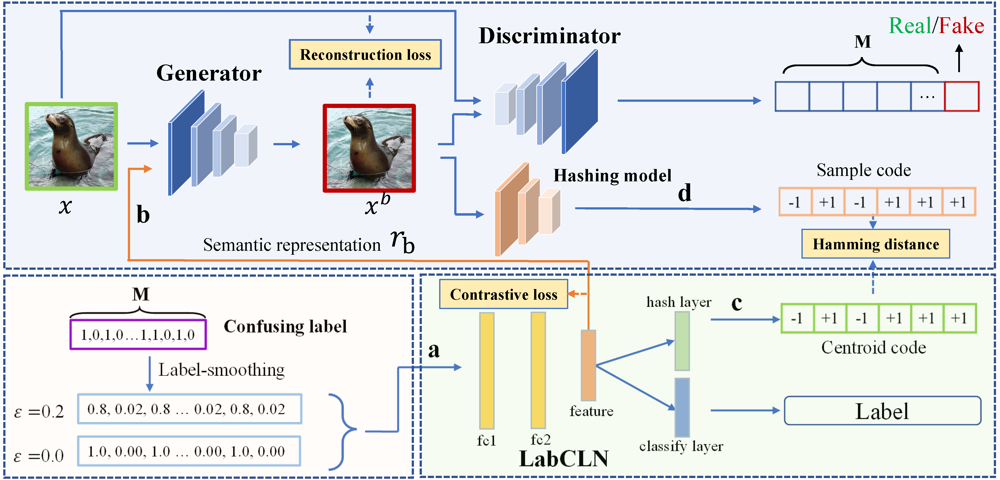

# BadHash

The implementation of our ACM MM 2022 paper "**BadHash: Invisible Backdoor Attacks against Deep Hashing with Clean Label**" 

## Abstract

Due to its powerful feature learning capability and high efficiency, deep hashing has achieved great success in large-scale image retrieval. Meanwhile, extensive works have demonstrated that deep neural networks (DNNs) are susceptible to adversarial examples, and exploring  adversarial attack against deep hashing has attracted many research efforts. Nevertheless, backdoor attack, another famous threat to DNNs, has not been studied for deep hashing yet. Although various backdoor attacks have been proposed in the field of image classification, existing approaches failed to realize a truly imperceptive backdoor attack that enjoys invisible triggers and clean label setting simultaneously, and they cannot meet the intrinsic demand of image retrieval backdoor. 

In this paper, we propose BadHash, the first  imperceptible backdoor attack against deep hashing, which can effectively generate invisible and input-specific poisoned images with clean label. We first propose a new conditional generative adversarial network (cGAN) pipeline to effectively generate poisoned samples. For any given benign image, it seeks to generate a natural-looking poisoned counterpart with a unique invisible trigger. In order to improve the attack effectiveness, we introduce a label-based contrastive learning network LabCLN to exploit the semantic characteristics of different labels, which are subsequently used  for confusing and misleading the target model to learn the embedded trigger. We finally explore the mechanism of backdoor attacks on image retrieval in the hash space. Extensive experiments on multiple benchmark datasets verify that BadHash can generate imperceptible poisoned samples with strong attack ability and transferability over state-of-the-art deep hashing schemes.




## Requirements   

- python 
- torch==1.8.0
- torchvision==0.9.0
- lpips==0.1.4

## Method

### Data Information

Take the ImageNet dataset as an example:

data/ImageNet_100:  Data used to train trigger generators

data/ImageNet_One: Data used to poison/test backdoors

data/bac_samples: Generated samples for poisoning/testing backdoors

data/ImageNet: Targeted poisoning dataset

### Train Trigger Genrator

Before running the code, please download the trained deep hash mode from [Baidudisk](https://pan.baidu.com/s/1dB3BoGQ8R2MJNAkm952oWw) (code:8m1j), and put them into `checkpoint` folder. Or you can train your own hash mode.

The detailed attack pipeline implementation.

```shell 
python train_tri_gen.py
```

### Generate Poisoned Samples

Use the trigger generator to generator poisoned samples.
```shell 
python implement_tri_gen.py
```

Note that you need to write the paths of the generated poisoned samples corresponding to the number of target classes into the training set to create the poisoned dataset. The xxx.txt files in each subdirectory of data denote the image paths and labels for each dataset respectively. Remember to set the path for each image correctly.
### Backdoor Training

Train the backdoored model using CSQ.

```shell 
python CSQ.py
```

Train the backdoored model using HashNet.
```shell 
python HashNet.py
```

